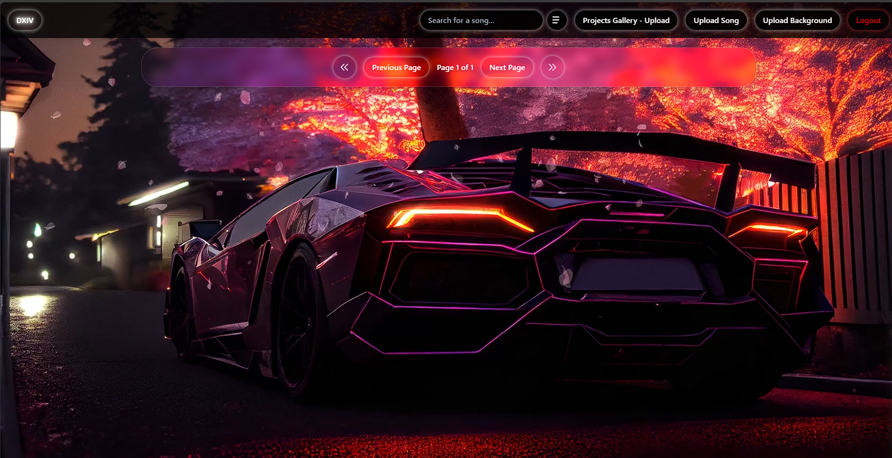

# ServerMusicSong - Web Music Player 

A feature-rich web-based music player application with user authentication, song management, and real-time audio visualizations.

 <!-- You'll need to add this -->

## 🌟 Features

- 🎵 Upload and play MP3/WAV audio files
- 🎨 Real-time audio visualization with wave effects
- 🎧 Built-in equalizer with presets
- 📱 Responsive design with mini-player
- 🔒 User authentication and admin verification
- 🔍 Search functionality
- 📋 Queue management
- 🎬 Custom background support (images/videos)
- 🔗 Direct upload from YouTube/SoundCloud links
- 🎚️ Volume boost and audio enhancement
 
## 📁 Directory Structure

```
ServerMusicSong/
├── DownloadWithLinkTool/     # YouTube/SoundCloud download utility
│   └── tool.py
├── RunAndUpdateLink/         # Cloudflare tunnel management
│   ├── cloudflare_url.txt
│   └── update_cloudflare_url.py
├── Verify Users/            # User verification tools
│   ├── verify_tool.py
│   └── readme.txt
├── static/                  # Frontend assets
│   ├── dashboard.js
│   ├── index.html
│   └── styles/
├── music/                   # Music storage
├── thumbnails/             # Track thumbnails
├── backgrounds/            # Custom backgrounds
├── randomthumbnail/       # Default thumbnails
├── avatars/               # User avatars
├── project_upload/        # Project files
├── app.py                 # Main server application
├── requirements.txt
└── README.md
```

## 🚀 Prerequisites

- Python 3.8+
- FFmpeg
- Cloudflare CLI
- Node.js (for development)

## ⚙️ Detailed Installation

### 1. Environment Setup
```bash
# Install Python 3.8+ from python.org

# Install virtualenv
pip install virtualenv

# Create virtual environment
python -m venv venv

# Activate virtual environment
# Windows:
venv\Scripts\activate
# Linux/Mac:
source venv/bin/activate

# Install required libraries
pip install -r requirements.txt
```

### 2. Install FFmpeg
- Windows: 
  1. Download FFmpeg from https://ffmpeg.org/download.html
  2. Extract and add the path to PATH
  3. Verify with command: `ffmpeg -version`

### 3. Install Cloudflare
- Windows:
  1. Download Cloudflared from https://developers.cloudflare.com/cloudflare-one/connections/connect-apps/install-and-setup/installation
  2. Add the path to PATH
  3. Verify: `cloudflared -v`

### 4. Configuration Setup

1. Create .env file:
```bash
# .env
JWT_SECRET_KEY=your-secret-key
FLASK_PORT=6001
CORS_ORIGINS=http://localhost:6001,https://your-cloudflare-url.com
```

2. Create necessary directories:
```bash
mkdir music thumbnails backgrounds randomthumbnail avatars project_upload
```

3. SSL Configuration (optional):
- Place cert.pem and key.pem in the root directory
- Update paths in app.py

### 5. Running the Application

1. Run Flask server:
```bash
python app.py
```

2. Start Cloudflare tunnel:
```bash
python RunAndUpdateLink/update_cloudflare_url.py
```

3. Access:
- Local: http://localhost:6001
- Public: URL in RunAndUpdateLink/cloudflare_url.txt

### 6. Default Admin Account
- Username: admin
- Password: admin_password

### 7. User Management
```bash
# Verify new users
python "Verify Users/verify_tool.py"
```

### 8. Advanced Configuration

1. Change admin password:
```bash
cd HashCreate
python create_hash.py
```

2. Music Loading Configuration:
- Place MP3/WAV music files in `music/` directory
- Place thumbnail images in `thumbnails/`
- Place background images in `backgrounds/`
- Place default thumbnails in `randomthumbnail/`

3. Download music from YouTube/SoundCloud:
```bash
cd DownloadWithLinkTool
python tool.py
```

### 9. Common Error Handling

1. FFmpeg Error:
```bash
pip install -U yt-dlp
```

2. SSL Error:
- Check cert.pem and key.pem
- Update paths in app.py

3. CORS Error:
- Check CORS_ORIGINS in .env
- Ensure Cloudflare URL is correct

4. Upload Error:
- Check directory permissions
- Ensure file names have no special characters

## 📝 License

This project is licensed under the MIT License - see the [LICENSE](LICENSE) file for details.

## 🤝 Contributing

1. Fork the repository
2. Create your feature branch
3. Commit your changes
4. Push to the branch
5. Create a new Pull Request
